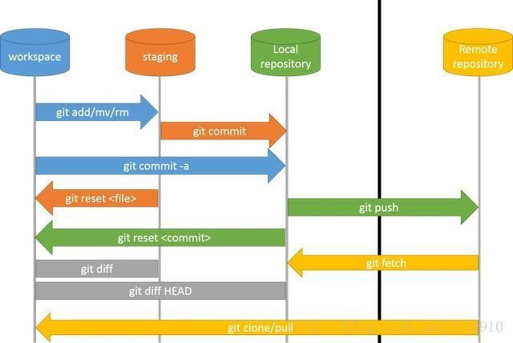
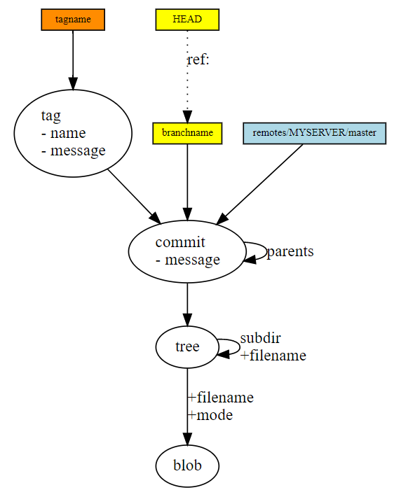

* 参考
  * https://csdiy.wiki/%E5%BF%85%E5%AD%A6%E5%B7%A5%E5%85%B7/Git/

* 常用操作




# 1、MIT 6.NULL--Version Control

## 1.1、数据模型

* data model
  * ```c
    // a file is a bunch of bytes
    type blob = array<byte>

    // a directory contains named files and directories
    type tree = map<string, tree | blob>

    // a commit has parents, metadata, and the top-level tree
    type commit = struct {
        parents: array<commit>
        author: string
        message: string
        snapshot: tree
    }


    type object = blob | tree | commit

    objects = map<string, object>

    def store(object):
        id = sha1(object)    // all objects are content-addressed by their SHA-1 hash
        objects[id] = object

    def load(id):
        return objects[id]
    ```

* 快照 <u>snapshot</u>：A snapshot is the top-level tree that is being tracked
  * 所有快照可以根据 SHA-1 哈希值追踪，但是不便于人类阅读和记忆 --> references
  * <u>References</u>：pointers to commits
    * master：points to the latest commit in the main branch of development
    * head：where we currently are

* 版本历史的表示
  * In Git, a <u>history </u>is a directed acyclic graph (DAG) of <u>snapshots</u>.  All this means is that each snapshot in Git refers to a set of “parents”, the snapshots that preceded it
  * ```c
    o <-- o <-- o <-- o <---- o
                ^            /
                 \          v
                  --- o <-- o
    ```
* <u>repository</u>：objects + references




## 1.2、Commit message

* https://cbea.ms/git-commit/

* 七个建议
  * Separate subject from body with a blank line
  * Limit the subject line to 50 characters
  * Capitalize the subject line
  * Do not end the subject line with a period
  * Use the imperative mood in the subject line
  * Wrap the body at 72 characters
  * Use the body to explain what and why vs. how


---

# 2、尚硅谷 

## 2.1 常用Git命令

```c
git config --global user.name xxx
git config --global user.email xxx
git init
git status
git add filename
git reflog
git log
git reset --hard 版本号

// 分支
git branch 分支名  // 创建分支
git branch -v     // 查看分支
git checkout 分支名    // 切换分支
git merge 分支名    // 把指定的分支合并到当前分支上
```


## 2.2 GitHub

```c
git remote -v    // 查看当前所有远程地址别名
git remote add 别名 远程地址  // 起别名
git push 别名 分支    // 推送本地分支上的内容到远程仓库
git clone 远程地址    // 将远程仓库的内容克隆到本地
git pull 远程库地址别名 远程分支名    // 将远程仓库对于分支最新内容拉下来后与本地分支直接合并
```


---

# 3、Pro Git